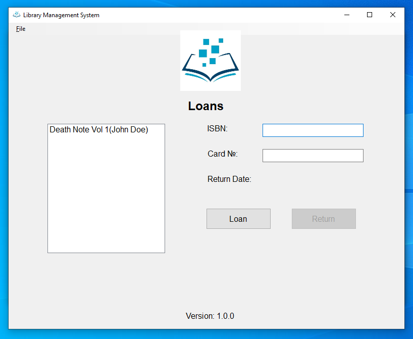

# LibraryManagementSystem (Winforms Desktop App)

MVP Desktop application for local council library. So Libarian can manage members, books and loans. Use barcode scanner to scan and input member card numbers and book ISBN's.
- C#, .NET
- Login, Cryptography
- Email validation, Regex
- DB, SQL, ADO.NET, Stored Procedures
- UI, WinForms
- Test project, Unit Testing (MSTest)

**Trello Board:** https://trello.com/b/DFmkp4xz/northfieldlibrarymanagementsystemkanban

## Screenshots

